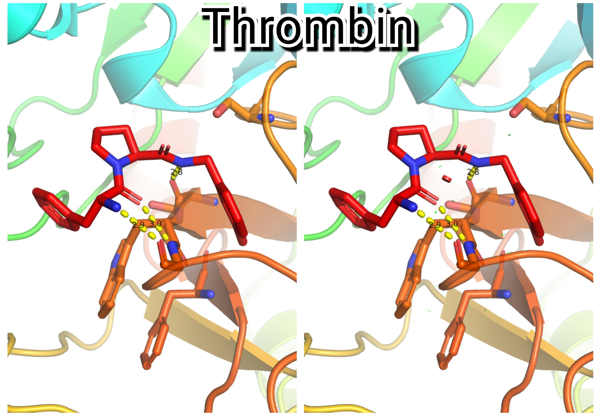
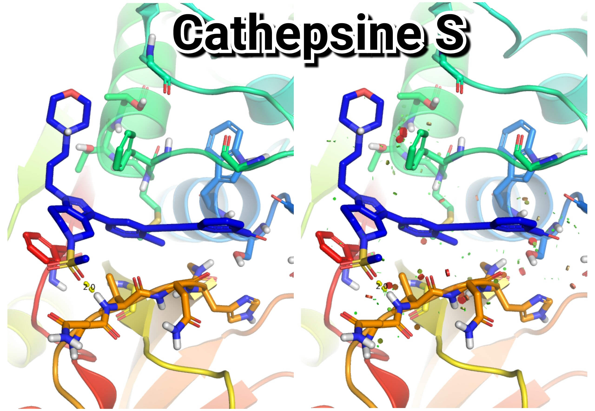

# A new PyMOL command to visualize receptor-ligand interactions and create publication-quality images. 

This script is also within the [Pymol-script-repo](https://pymolwiki.org/index.php/Git_install_scripts), which I strongly recommend to install. In that case you just need to import it into PyMOL:
```
import show_ligand_interactions
```
Otherwise you can download it from here and load it on PyMOL every time you launch it.
```
run <path to show_ligand_interactions.py
```

### USAGE:
```
ARGUMENTS

    recsel = string: atom selection of the receptor {default: "not hetatm"}

    ligsel = string: atom selections of the ligand {default: "hetatm"}

    cutoff = float: show as sticks all receptor residues within this distance from the ligand {default: 5.0}
```

### EXAMPLE:
```
fetch 2ZC9
remove resn HOH
import show_ligand_interactions
show_ligand_interactions 2ZC9 and not resn 22U, 2ZC9 and resn 22U, 4
```

Optionally, you can display the van der Walls overlaps by red disks.
```
show_bumps pocket or ligand, clashes
```

Once you decide your favorable pose, you can save the image.
```
import make_figure
make_figure ligand_interactions.png, single, size=900, opaque
```




### Some other example Figures generated using "show_ligand_interactions".



